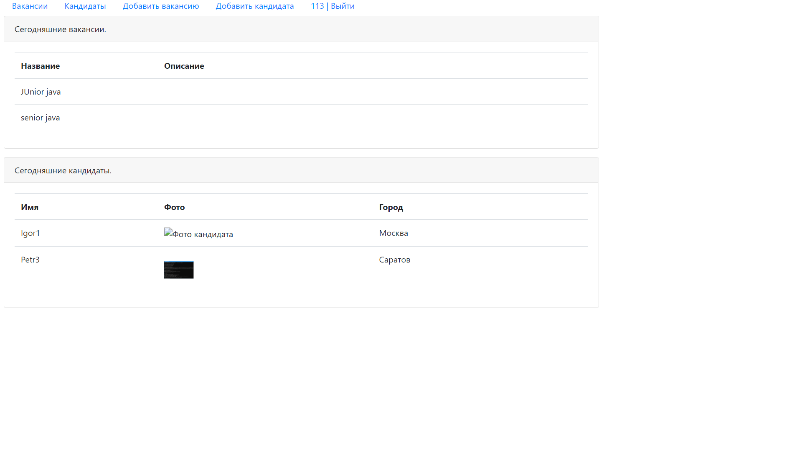
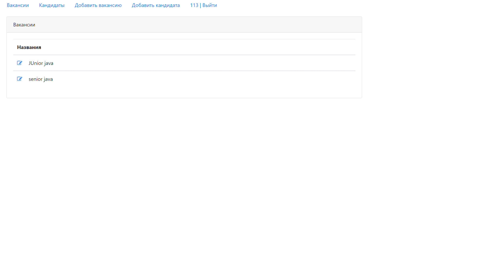
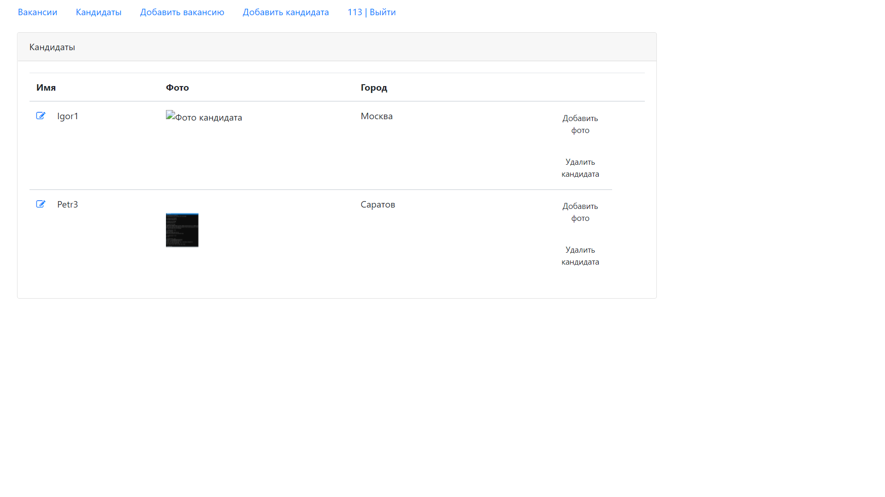
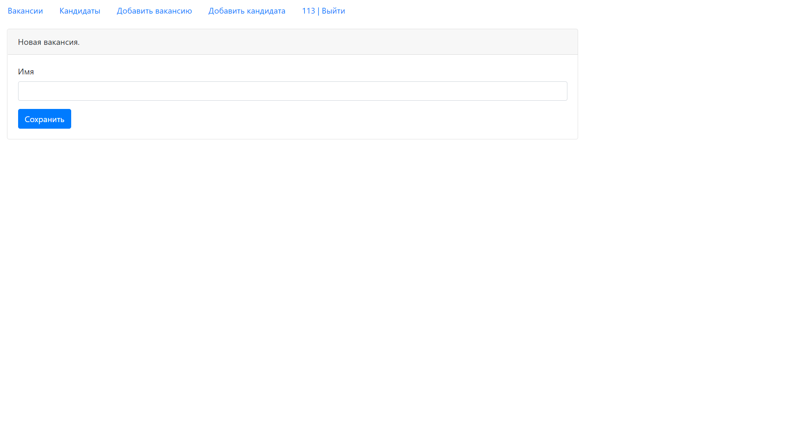
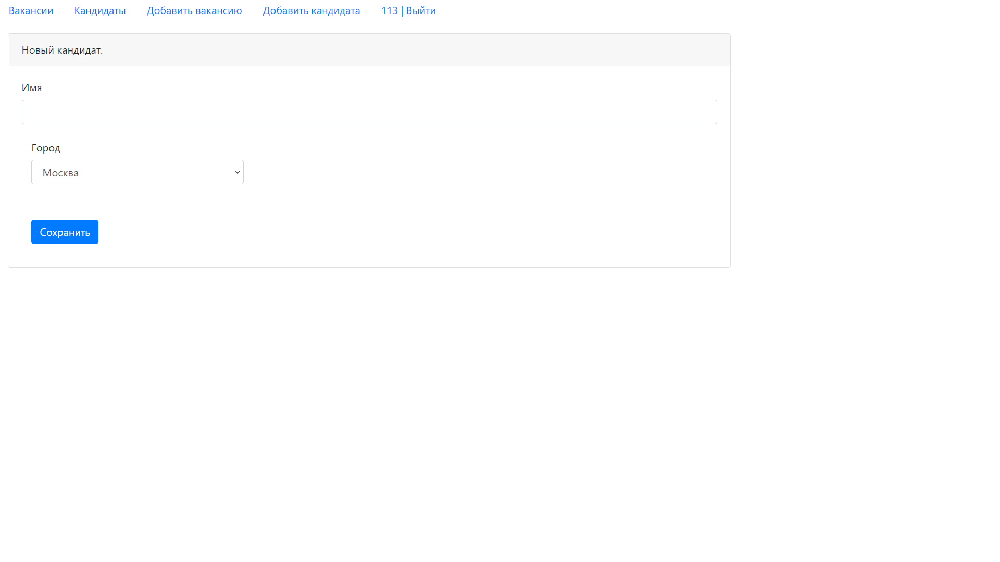

# job4j_dreamjob

Проект представляет собой агрегатор вакансий.
На главной странице отображается список размещенных вакансий и перечень кандидатов на сегодняшнюю дату.

На странице "Вакансии" представлен список вакансий, имеющихся в базе.

На странице "Кандидаты" представлен список кандидатов с фотографиями и городом проживания.

Возможно добавить новую вакансию

Или нового кандидата

